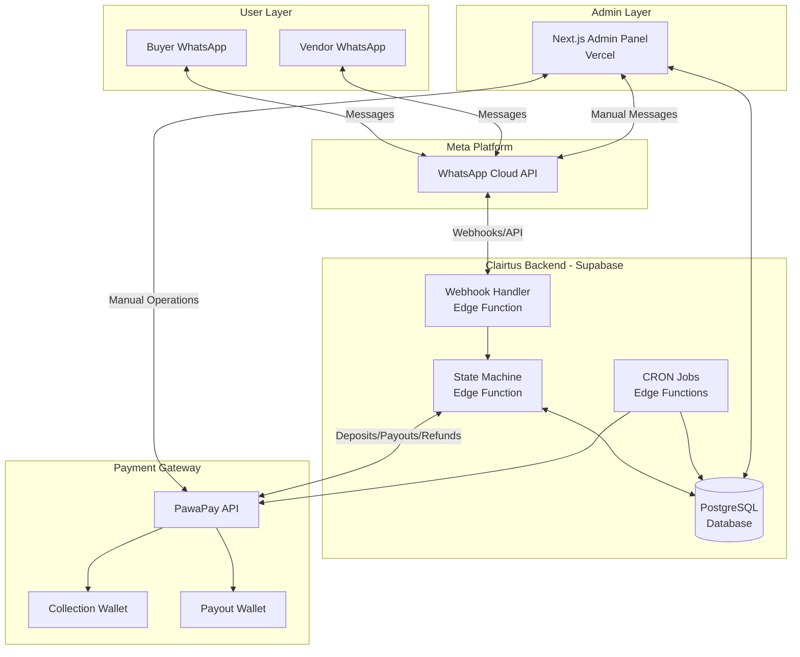
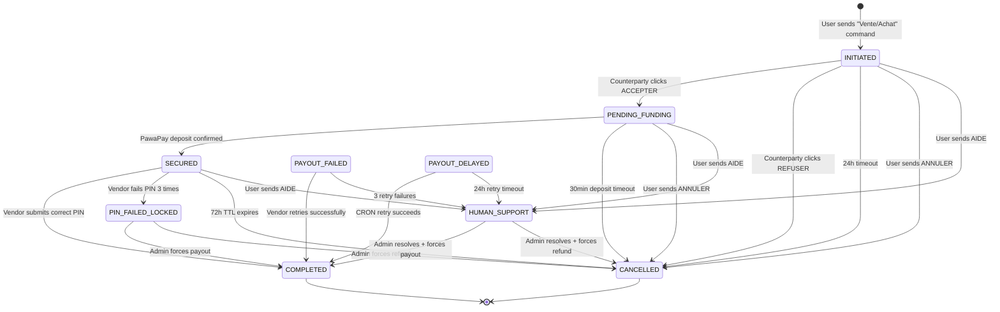
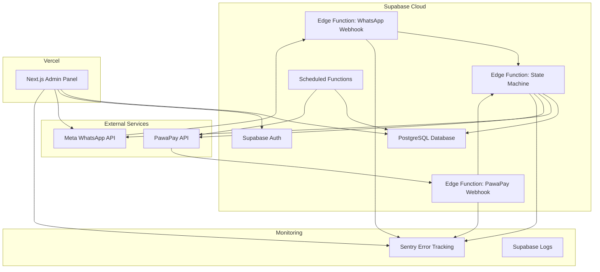

# Design Document: Clairtus Escrow Bot

## Overview

Clairtus is a WhatsApp-native escrow bot that provides secure payment intermediation for informal social commerce in the Democratic Republic of Congo (DRC). The system operates as a conversational state machine that coordinates buyer deposits, vendor payouts, and delivery verification through a 4-digit PIN mechanism.

### Core Value Proposition

- **Zero App Footprint**: 100% interaction via Meta WhatsApp Cloud API
- **Binary Escrow**: Funds released only upon exact PIN match
- **Sub-3-Second Payouts**: Critical for street-level delivery scenarios
- **Self-Healing**: Automatic recovery from MNO timeouts and wallet limits
- **Dual-Sided Initiation**: Either buyer or vendor can start the transaction

### Design Principles

1. **Simplicity Over Flexibility**: USD monocurrency, French-only, no subjective dispute resolution
2. **State Machine Purity**: Every transaction state has exactly one set of valid transitions
3. **Idempotency First**: All external API calls use transaction UUID as idempotency key
4. **Fail-Safe Defaults**: Unknown states trigger human escalation, not silent failures
5. **Institutional Feel**: Interactive buttons and formal messaging to build trust

## Architecture

### System Components



### Technology Stack

| Component | Technology | Justification |
|-----------|-----------|---------------|
| **Backend Runtime** | Supabase Edge Functions (Deno/TypeScript) | Sub-second webhook response, built-in PostgreSQL integration |
| **Database** | Supabase PostgreSQL with RLS | ACID transactions, foreign key enforcement, automatic audit trails |
| **Messaging API** | Meta WhatsApp Cloud API | Native WhatsApp integration, Interactive Button support |
| **Payment Gateway** | PawaPay API | DRC MNO coverage, USD support, idempotency guarantees |
| **Admin Panel** | Next.js (Vercel) | Real-time dashboard, manual intervention interface |
| **CRON Scheduler** | Supabase Scheduled Functions | TTL enforcement, payout retries, balance monitoring |

### Data Flow Patterns

#### Pattern 1: Inbound Message Processing

```
WhatsApp User → Meta Webhook → Supabase Edge Function → 
  1. Validate X-Hub-Signature-256
  2. Parse message content
  3. Query current transaction state
  4. Execute state transition
  5. Update database (atomic transaction)
  6. Call external APIs (PawaPay/Meta)
  7. Return HTTP 200 within 2 seconds
```

#### Pattern 2: PawaPay Webhook Processing

```
PawaPay Event → Supabase Edge Function →
  1. Validate PawaPay signature
  2. Extract idempotency key (transaction UUID)
  3. Check if state transition already applied
  4. If not applied: Execute state transition
  5. Send WhatsApp notifications
  6. Return HTTP 200 within 5 seconds
```

#### Pattern 3: CRON Job Execution

```
Supabase Scheduler (every 15 minutes) →
  1. Query transactions with status = PAYOUT_DELAYED
  2. For each: Retry PawaPay payout with same idempotency key
  3. Update state based on response
  4. Send notifications on success/failure
```

## Components and Interfaces

### 1. Webhook Handler (Edge Function)

**Responsibility**: Receive and validate all inbound webhooks from Meta and PawaPay.

**Endpoints**:

- `POST /api/whatsapp-webhook` - Meta WhatsApp Cloud API webhooks
- `POST /api/pawapay-webhook` - PawaPay payment event webhooks
- `GET /api/whatsapp-webhook` - Meta webhook verification challenge

**Security**:

```typescript
// Meta Webhook Validation
function validateMetaSignature(payload: string, signature: string): boolean {
  const expectedSignature = crypto
    .createHmac('sha256', META_APP_SECRET)
    .update(payload)
    .digest('hex');
  return crypto.timingSafeEqual(
    Buffer.from(signature),
    Buffer.from(`sha256=${expectedSignature}`)
  );
}

// PawaPay Webhook Validation
function validatePawaPaySignature(payload: string, signature: string): boolean {
  const expectedSignature = crypto
    .createHmac('sha256', PAWAPAY_API_SECRET)
    .update(payload)
    .digest('hex');
  return crypto.timingSafeEqual(
    Buffer.from(signature),
    Buffer.from(expectedSignature)
  );
}
```

**Rate Limiting**:

- Per-user: 5 transaction initiations per hour
- Per-IP: 100 requests per minute (webhook endpoint)
- Implemented using Supabase Edge Function middleware with Redis-backed counters

### 2. State Machine Engine (Edge Function)

**Responsibility**: Execute all transaction state transitions and orchestrate external API calls.

**Core Interface**:

```typescript
interface StateTransition {
  transactionId: string;
  currentState: TransactionStatus;
  event: StateEvent;
  metadata?: Record<string, any>;
}

enum TransactionStatus {
  INITIATED = 'INITIATED',
  PENDING_FUNDING = 'PENDING_FUNDING',
  SECURED = 'SECURED',
  COMPLETED = 'COMPLETED',
  CANCELLED = 'CANCELLED',
  PIN_FAILED_LOCKED = 'PIN_FAILED_LOCKED',
  PAYOUT_FAILED = 'PAYOUT_FAILED',
  PAYOUT_DELAYED = 'PAYOUT_DELAYED',
  HUMAN_SUPPORT = 'HUMAN_SUPPORT'
}

enum StateEvent {
  COUNTERPARTY_ACCEPTED = 'COUNTERPARTY_ACCEPTED',
  COUNTERPARTY_REJECTED = 'COUNTERPARTY_REJECTED',
  DEPOSIT_CONFIRMED = 'DEPOSIT_CONFIRMED',
  PIN_VALIDATED = 'PIN_VALIDATED',
  PIN_FAILED = 'PIN_FAILED',
  PAYOUT_SUCCEEDED = 'PAYOUT_SUCCEEDED',
  PAYOUT_FAILED_LIMIT = 'PAYOUT_FAILED_LIMIT',
  PAYOUT_FAILED_TIMEOUT = 'PAYOUT_FAILED_TIMEOUT',
  TTL_EXPIRED = 'TTL_EXPIRED',
  USER_CANCELLED = 'USER_CANCELLED',
  HUMAN_REQUESTED = 'HUMAN_REQUESTED'
}

async function executeTransition(transition: StateTransition): Promise<void> {
  // 1. Validate transition is legal
  if (!isValidTransition(transition.currentState, transition.event)) {
    throw new Error(`Invalid transition: ${transition.currentState} -> ${transition.event}`);
  }
  
  // 2. Begin database transaction
  const dbTransaction = await supabase.transaction();
  
  try {
    // 3. Execute state-specific logic
    const newState = await transitionLogic[transition.event](transition, dbTransaction);
    
    // 4. Update transaction status
    await dbTransaction.update('transactions', {
      status: newState,
      updated_at: new Date()
    }).where('id', transition.transactionId);
    
    // 5. Log state change
    await dbTransaction.insert('transaction_status_log', {
      transaction_id: transition.transactionId,
      old_status: transition.currentState,
      new_status: newState,
      event: transition.event,
      changed_at: new Date()
    });
    
    // 6. Commit database transaction
    await dbTransaction.commit();
    
    // 7. Execute side effects (API calls, notifications)
    await executeSideEffects(newState, transition);
    
  } catch (error) {
    await dbTransaction.rollback();
    throw error;
  }
}
```

### 3. Message Parser (Module)

**Responsibility**: Extract transaction parameters from natural language input.

**Regex Patterns**:

```typescript
const VENTE_PATTERN = /^Vente\s+(\d+(?:\.\d{1,2})?)\s+USD\s+(.+?)\s+au\s+([\d\s\+\-\(\)]+)$/i;
const ACHAT_PATTERN = /^Achat\s+(\d+(?:\.\d{1,2})?)\s+USD\s+(.+?)\s+au\s+([\d\s\+\-\(\)]+)$/i;

interface ParsedTransaction {
  type: 'VENTE' | 'ACHAT';
  amount: number;
  itemDescription: string;
  counterpartyPhone: string;
}

function parseTransactionMessage(message: string): ParsedTransaction | null {
  // Try VENTE pattern
  let match = message.match(VENTE_PATTERN);
  if (match) {
    return {
      type: 'VENTE',
      amount: parseFloat(match[1]),
      itemDescription: match[2].substring(0, 200), // Truncate to 200 chars
      counterpartyPhone: normalizePhoneNumber(match[3])
    };
  }
  
  // Try ACHAT pattern
  match = message.match(ACHAT_PATTERN);
  if (match) {
    return {
      type: 'ACHAT',
      amount: parseFloat(match[1]),
      itemDescription: match[2].substring(0, 200),
      counterpartyPhone: normalizePhoneNumber(match[3])
    };
  }
  
  return null;
}
```

**Phone Number Normalization**:

```typescript
function normalizePhoneNumber(input: string): string {
  // Remove all non-digit characters
  let digits = input.replace(/\D/g, '');
  
  // Case 1: 10 digits starting with 0 (e.g., 0898765432)
  if (digits.length === 10 && digits.startsWith('0')) {
    digits = digits.substring(1); // Remove leading 0
    return `+243${digits}`;
  }
  
  // Case 2: 12 digits starting with 243 (e.g., 243898765432)
  if (digits.length === 12 && digits.startsWith('243')) {
    return `+${digits}`;
  }
  
  // Case 3: Already in E.164 format (e.g., +243898765432)
  if (input.startsWith('+243') && digits.length === 12) {
    return input;
  }
  
  // Invalid format
  throw new Error('Invalid phone number format');
}
```

### 4. PIN Generator (Module)

**Responsibility**: Generate cryptographically secure 4-digit PINs.

```typescript
function generateSecretPIN(): string {
  // Use crypto.randomInt for cryptographic security
  const pin = crypto.randomInt(0, 10000).toString().padStart(4, '0');
  return pin;
}

function validatePIN(submitted: string, stored: string): boolean {
  // Constant-time comparison to prevent timing attacks
  return crypto.timingSafeEqual(
    Buffer.from(submitted),
    Buffer.from(stored)
  );
}
```

### 5. PawaPay Integration (Module)

**Responsibility**: Handle all payment gateway interactions with idempotency guarantees.

**API Endpoints Used**:

- `POST /v1/deposits` - Initiate buyer deposit
- `POST /v1/payouts` - Execute vendor payout
- `POST /v1/refunds` - Process buyer refund
- `GET /v1/balances` - Query wallet balances

**Idempotency Implementation**:

```typescript
interface PawaPay
DepositRequest {
  idempotencyKey: string; // Transaction UUID
  amount: number;
  currency: 'USD';
  phoneNumber: string; // E.164 format
  description: string;
}

async function initiateDeposit(request: PawaPay
DepositRequest): Promise<string> {
  const response = await fetch('https://api.pawapay.io/v1/deposits', {
    method: 'POST',
    headers: {
      'Content-Type': 'application/json',
      'Authorization': `Bearer ${PAWAPAY_API_KEY}`,
      'Idempotency-Key': request.idempotencyKey
    },
    body: JSON.stringify({
      depositId: request.idempotencyKey,
      amount: request.amount.toFixed(2),
      currency: request.currency,
      // PawaPay Checkout Page handles network selection
      payer: {
        type: 'MSISDN',
        address: {
          value: request.phoneNumber
        }
      },
      customerTimestamp: new Date().toISOString(),
      statementDescription: request.description
    })
  });
  
  if (!response.ok) {
    throw new Error(`PawaPay deposit failed: ${response.statusText}`);
  }
  
  const data = await response.json();
  return data.redirectUrl; // URL for buyer to complete payment
}
```

### 6. Meta WhatsApp Integration (Module)

**Responsibility**: Send messages and Interactive Buttons via WhatsApp Cloud API.

**Message Types**:

```typescript
interface WhatsAppTextMessage {
  to: string; // E.164 phone number
  type: 'text';
  text: {
    body: string;
  };
}

interface WhatsAppInteractiveMessage {
  to: string;
  type: 'interactive';
  interactive: {
    type: 'button';
    header?: {
      type: 'text';
      text: string;
    };
    body: {
      text: string;
    };
    action: {
      buttons: Array<{
        type: 'reply';
        reply: {
          id: string; // Payload identifier
          title: string; // Button label (max 20 chars)
        };
      }>;
    };
  };
}

async function sendInteractiveButton(
  phoneNumber: string,
  header: string,
  body: string,
  buttons: Array<{ id: string; title: string }>
): Promise<void> {
  const message: WhatsAppInteractiveMessage = {
    to: phoneNumber,
    type: 'interactive',
    interactive: {
      type: 'button',
      header: { type: 'text', text: header },
      body: { text: body },
      action: {
        buttons: buttons.map(btn => ({
          type: 'reply',
          reply: { id: btn.id, title: btn.title }
        }))
      }
    }
  };
  
  await fetch(`https://graph.facebook.com/v18.0/${WHATSAPP_PHONE_NUMBER_ID}/messages`, {
    method: 'POST',
    headers: {
      'Content-Type': 'application/json',
      'Authorization': `Bearer ${WHATSAPP_ACCESS_TOKEN}`
    },
    body: JSON.stringify(message)
  });
}
```

**Text Fallback Handling**:

```typescript
const TEXT_FALLBACK_MAP: Record<string, string> = {
  'accepter': 'ACCEPTER_PAYLOAD',
  'oui': 'ACCEPTER_PAYLOAD',
  'accepte': 'ACCEPTER_PAYLOAD',
  'refuser': 'REFUSER_PAYLOAD',
  'non': 'REFUSER_PAYLOAD',
  'aide': 'AIDE_PAYLOAD',
  'help': 'AIDE_PAYLOAD',
  'support': 'AIDE_PAYLOAD',
  'annuler': 'ANNULER_PAYLOAD'
};

function normalizeTextToPayload(text: string): string | null {
  const normalized = text.toLowerCase().trim();
  return TEXT_FALLBACK_MAP[normalized] || null;
}
```

## Data Models

### Database Schema (PostgreSQL DDL)

```sql
-- Enable UUID extension
CREATE EXTENSION IF NOT EXISTS "uuid-ossp";

-- Users table
CREATE TABLE users (
    phone_number VARCHAR(20) PRIMARY KEY CHECK (phone_number ~ '^\+243[0-9]{9}$'),
    created_at TIMESTAMP WITH TIME ZONE DEFAULT NOW() NOT NULL,
    successful_transactions INT DEFAULT 0 NOT NULL CHECK (successful_transactions >= 0),
    cancelled_transactions INT DEFAULT 0 NOT NULL CHECK (cancelled_transactions >= 0),
    is_suspended BOOLEAN DEFAULT FALSE NOT NULL,
    last_transaction_at TIMESTAMP WITH TIME ZONE
);

-- Index for performance
CREATE INDEX idx_users_suspended ON users(is_suspended) WHERE is_suspended = TRUE;

-- Transactions table
CREATE TABLE transactions (
    id UUID PRIMARY KEY DEFAULT uuid_generate_v4(),
    created_at TIMESTAMP WITH TIME ZONE DEFAULT NOW() NOT NULL,
    updated_at TIMESTAMP WITH TIME ZONE DEFAULT NOW() NOT NULL,
    expires_at TIMESTAMP WITH TIME ZONE DEFAULT (NOW() + INTERVAL '72 hours') NOT NULL,
    
    -- Status tracking
    status VARCHAR(50) NOT NULL CHECK (status IN (
        'INITIATED',
        'PENDING_FUNDING',
        'SECURED',
        'COMPLETED',
        'CANCELLED',
        'PIN_FAILED_LOCKED',
        'PAYOUT_FAILED',
        'PAYOUT_DELAYED',
        'HUMAN_SUPPORT'
    )),
    
    -- Parties
    seller_phone VARCHAR(20) NOT NULL REFERENCES users(phone_number) ON DELETE RESTRICT,
    buyer_phone VARCHAR(20) NOT NULL REFERENCES users(phone_number) ON DELETE RESTRICT,
    initiator_phone VARCHAR(20) NOT NULL REFERENCES users(phone_number) ON DELETE RESTRICT,
    
    -- Transaction details
    item_description TEXT NOT NULL CHECK (LENGTH(item_description) <= 200),
    currency VARCHAR(3) DEFAULT 'USD' NOT NULL CHECK (currency = 'USD'),
    base_amount DECIMAL(10,2) NOT NULL CHECK (base_amount >= 1.00 AND base_amount <= 2500.00),
    mno_fee DECIMAL(10,2) NOT NULL CHECK (mno_fee >= 0),
    clairtus_fee DECIMAL(10,2) NOT NULL CHECK (clairtus_fee >= 0),
    
    -- Security
    secret_pin VARCHAR(4) CHECK (secret_pin ~ '^[0-9]{4}$'),
    pin_attempts INT DEFAULT 0 NOT NULL CHECK (pin_attempts >= 0 AND pin_attempts <= 3),
    
    -- External references
    pawapay_deposit_id VARCHAR(100) UNIQUE,
    pawapay_payout_id VARCHAR(100) UNIQUE,
    pawapay_refund_id VARCHAR(100) UNIQUE,
    
    -- Flags
    requires_human BOOLEAN DEFAULT FALSE NOT NULL,
    
    -- Constraints
    CHECK (seller_phone != buyer_phone),
    CHECK (initiator_phone IN (seller_phone, buyer_phone))
);

-- Indexes for performance
CREATE INDEX idx_transactions_status ON transactions(status);
CREATE INDEX idx_transactions_expires_at ON transactions(expires_at) WHERE status IN ('INITIATED', 'SECURED');
CREATE INDEX idx_transactions_seller ON transactions(seller_phone);
CREATE INDEX idx_transactions_buyer ON transactions(buyer_phone);
CREATE INDEX idx_transactions_requires_human ON transactions(requires_human) WHERE requires_human = TRUE;
CREATE INDEX idx_transactions_payout_delayed ON transactions(status) WHERE status = 'PAYOUT_DELAYED';

-- Trigger to update updated_at
CREATE OR REPLACE FUNCTION update_updated_at_column()
RETURNS TRIGGER AS $$
BEGIN
    NEW.updated_at = NOW();
    RETURN NEW;
END;
$$ LANGUAGE plpgsql;

CREATE TRIGGER update_transactions_updated_at
    BEFORE UPDATE ON transactions
    FOR EACH ROW
    EXECUTE FUNCTION update_updated_at_column();

-- Transaction status log (audit trail)
CREATE TABLE transaction_status_log (
    id BIGSERIAL PRIMARY KEY,
    transaction_id UUID NOT NULL REFERENCES transactions(id) ON DELETE CASCADE,
    old_status VARCHAR(50),
    new_status VARCHAR(50) NOT NULL,
    event VARCHAR(100),
    reason TEXT,
    changed_at TIMESTAMP WITH TIME ZONE DEFAULT NOW() NOT NULL,
    changed_by VARCHAR(100) -- 'SYSTEM' or admin user ID
);

CREATE INDEX idx_status_log_transaction ON transaction_status_log(transaction_id, changed_at DESC);

-- Messages log (admin custom messages)
CREATE TABLE messages_log (
    id BIGSERIAL PRIMARY KEY,
    transaction_id UUID REFERENCES transactions(id) ON DELETE SET NULL,
    recipient_phone VARCHAR(20) NOT NULL,
    message_text TEXT NOT NULL,
    sent_at TIMESTAMP WITH TIME ZONE DEFAULT NOW() NOT NULL,
    sent_by VARCHAR(100) NOT NULL, -- Admin user ID
    whatsapp_message_id VARCHAR(100),
    delivery_status VARCHAR(50) DEFAULT 'PENDING'
);

CREATE INDEX idx_messages_log_transaction ON messages_log(transaction_id);
CREATE INDEX idx_messages_log_recipient ON messages_log(recipient_phone, sent_at DESC);

-- Error logs
CREATE TABLE error_logs (
    id BIGSERIAL PRIMARY KEY,
    transaction_id UUID REFERENCES transactions(id) ON DELETE SET NULL,
    error_type VARCHAR(100) NOT NULL, -- 'PAWAPAY_API', 'META_API', 'WEBHOOK_VALIDATION', 'DATABASE'
    error_message TEXT NOT NULL,
    error_details JSONB,
    occurred_at TIMESTAMP WITH TIME ZONE DEFAULT NOW() NOT NULL,
    resolved BOOLEAN DEFAULT FALSE
);

CREATE INDEX idx_error_logs_transaction ON error_logs(transaction_id);
CREATE INDEX idx_error_logs_type ON error_logs(error_type, occurred_at DESC);
CREATE INDEX idx_error_logs_unresolved ON error_logs(resolved) WHERE resolved = FALSE;

-- Row Level Security (RLS) Policies
ALTER TABLE users ENABLE ROW LEVEL SECURITY;
ALTER TABLE transactions ENABLE ROW LEVEL SECURITY;
ALTER TABLE transaction_status_log ENABLE ROW LEVEL SECURITY;
ALTER TABLE messages_log ENABLE ROW LEVEL SECURITY;
ALTER TABLE error_logs ENABLE ROW LEVEL SECURITY;

-- Admin role can access everything
CREATE POLICY admin_all_users ON users FOR ALL TO authenticated USING (true);
CREATE POLICY admin_all_transactions ON transactions FOR ALL TO authenticated USING (true);
CREATE POLICY admin_all_status_log ON transaction_status_log FOR ALL TO authenticated USING (true);
CREATE POLICY admin_all_messages ON messages_log FOR ALL TO authenticated USING (true);
CREATE POLICY admin_all_errors ON error_logs FOR ALL TO authenticated USING (true);

-- Service role (Edge Functions) can access everything
CREATE POLICY service_all_users ON users FOR ALL TO service_role USING (true);
CREATE POLICY service_all_transactions ON transactions FOR ALL TO service_role USING (true);
CREATE POLICY service_all_status_log ON transaction_status_log FOR ALL TO service_role USING (true);
CREATE POLICY service_all_messages ON messages_log FOR ALL TO service_role USING (true);
CREATE POLICY service_all_errors ON error_logs FOR ALL TO service_role USING (true);
```

### Fee Calculation Logic

```typescript
interface FeeCalculation {
  baseAmount: number;
  mnoFee: number; // 1.5% of base_amount
  clairtus
Fee: number; // 2.5% of base_amount
  depositAmount: number; // base_amount + mno_fee
  payoutAmount: number; // base_amount - clairtus_fee
  refundAmount: number; // base_amount only (MNO fee non-refundable)
}

function calculateFees(baseAmount: number): FeeCalculation {
  const mnoFee = Math.round(baseAmount * 0.015 * 100) / 100; // Round to 2 decimals
  const clairtus
Fee = Math.round(baseAmount * 0.025 * 100) / 100;
  
  return {
    baseAmount,
    mnoFee,
    clairtus
Fee,
    depositAmount: baseAmount + mnoFee,
    payoutAmount: baseAmount - clairtus
Fee,
    refundAmount: baseAmount
  };
}
```

## State Machine Specification

### Complete State Transition Diagram



### State Definitions and Transitions

#### State: INITIATED

**Entry Conditions**:
- User sends valid "Vente [Amount] USD [Item] au [Phone]" or "Achat [Amount] USD [Item] au [Phone]"
- Amount between 1-2500 USD
- Currency is USD
- Phone number normalizes to valid E.164 format
- Float balance > 500 USD
- User not suspended
- User has < 5 transactions in last hour

**Actions on Entry**:
1. Create transaction row with status = INITIATED
2. Calculate and store mno_fee and clairtus
_fee
3. Query trust scores for both parties
4. Send Interactive Button to counterparty with ACCEPTER/REFUSER/AIDE options
5. Set expires_at to NOW() + 24 hours

**Messages Sent**:
- To Counterparty:
```
🔒 Clairtus - Sécurisation de paiement

Le [vendeur/acheteur] ([phone]) souhaite [vendre/acheter]: [item_description] pour [base_amount] USD.

📊 Statistiques: 🟢 [X] ventes réussies | ❌ [Y] annulations

Votre argent sera bloqué en sécurité jusqu'à la livraison.

[ACCEPTER] [REFUSER] [AIDE]
```

**Valid Transitions**:
- → PENDING_FUNDING (counterparty accepts)
- → CANCELLED (counterparty refuses, 24h timeout, or user cancels)
- → HUMAN_SUPPORT (user requests help)

---

#### State: PENDING_FUNDING

**Entry Conditions**:
- Previous state was INITIATED
- Counterparty clicked ACCEPTER or sent text "Accepter"/"Oui"

**Actions on Entry**:
1. Update status to PENDING_FUNDING
2. Call PawaPay /v1/deposits with:
   - Amount: base_amount + mno_fee
   - Idempotency key: transaction UUID
   - Phone: buyer_phone
3. Store pawapay_deposit_id
4. Send deposit URL to buyer

**Messages Sent**:
- To Buyer:
```
Parfait. Cliquez sur ce lien sécurisé pour bloquer vos fonds via Mobile Money:
[PawaPay URL]
```

**Valid Transitions**:
- → SECURED (PawaPay webhook confirms deposit)
- → CANCELLED (30min timeout or user cancels)
- → HUMAN_SUPPORT (user requests help)

**Timeout Logic**:
- CRON job checks for transactions in PENDING_FUNDING > 30 minutes
- Automatically transitions to CANCELLED

---

#### State: SECURED

**Entry Conditions**:
- Previous state was PENDING_FUNDING
- PawaPay webhook received with status = COMPLETED for deposit

**Actions on Entry**:
1. Update status to SECURED
2. Generate 4-digit secret_pin using crypto.randomInt
3. Store secret_pin in database
4. Set expires_at to NOW() + 72 hours
5. Send PIN to buyer
6. Send delivery notification to vendor

**Messages Sent**:
- To Buyer:
```
🔐 Paiement Bloqué

Voici votre code PIN de livraison: [XXXX]

⚠️ ALERTE SÉCURITÉ: Le livreur NE PEUT PAS vous demander ce code par téléphone. Ne donnez ce code que lorsque vous tenez l'article dans vos mains.
```

- To Vendor:
```
✅ Fonds Sécurisés!

Le client a bloqué [base_amount] USD. Livrez la commande. Demandez au client son Code PIN à 4 chiffres et envoyez-le ici pour être payé.
```

**Valid Transitions**:
- → COMPLETED (vendor submits correct PIN)
- → PIN_FAILED_LOCKED (vendor fails PIN 3 times)
- → PAYOUT_FAILED (payout fails due to wallet limit)
- → PAYOUT_DELAYED (payout fails due to MNO timeout)
- → CANCELLED (72h TTL expires)
- → HUMAN_SUPPORT (user requests help)

**PIN Validation Logic**:
```typescript
async function handlePINSubmission(transactionId: string, submittedPIN: string): Promise<void> {
  const tx = await getTransaction(transactionId);
  
  if (tx.status !== 'SECURED') {
    throw new Error('Transaction not in SECURED state');
  }
  
  if (submittedPIN.length !== 4 || !/^\d{4}$/.test(submittedPIN)) {
    await sendMessage(tx.seller_phone, 'Format invalide. Envoyez un code à 4 chiffres.');
    return;
  }
  
  const isValid = crypto.timingSafeEqual(
    Buffer.from(submittedPIN),
    Buffer.from(tx.secret_pin)
  );
  
  if (isValid) {
    // Initiate payout
    await initiatePayout(transactionId);
  } else {
    // Increment attempt counter
    const newAttempts = tx.pin_attempts + 1;
    await updateTransaction(transactionId, { pin_attempts: newAttempts });
    
    if (newAttempts >= 3) {
      await transitionTo(transactionId, 'PIN_FAILED_LOCKED');
    } else {
      await sendMessage(
        tx.seller_phone,
        `Code incorrect. Veuillez réessayer. (${newAttempts}/3 tentatives)`
      );
    }
  }
}
```

---

#### State: COMPLETED

**Entry Conditions**:
- Previous state was SECURED, PAYOUT_FAILED, or PAYOUT_DELAYED
- PawaPay payout webhook received with status = COMPLETED

**Actions on Entry**:
1. Update status to COMPLETED
2. Increment successful_transactions for both buyer and vendor
3. Update last_transaction_at for both users
4. Send success notifications

**Messages Sent**:
- To Vendor:
```
🎉 Succès! Code valide.

Vos fonds ([payout_amount] USD) sont en route vers votre compte Mobile Money.
```

- To Buyer:
```
✅ Transaction terminée.

Le vendeur a reçu le paiement.
```

**Valid Transitions**:
- None (terminal state)

**Performance SLA**:
- Time from PIN validation to payout webhook: < 3 seconds (P95)

---

#### State: CANCELLED

**Entry Conditions**:
- Counterparty rejected in INITIATED
- User cancelled in INITIATED or PENDING_FUNDING
- 24h timeout in INITIATED
- 30min timeout in PENDING_FUNDING
- 72h TTL expired in SECURED
- Admin forced refund

**Actions on Entry**:
1. Update status to CANCELLED
2. If funds were deposited: Call PawaPay refund API
3. Update cancelled_transactions counter (for party at fault)
4. Send cancellation notifications

**Fault Attribution Logic**:
```typescript
function determineFaultParty(tx: Transaction, reason: string): 'BUYER' | 'VENDOR' | 'NONE' {
  if (reason === 'TTL_EXPIRED' && tx.status === 'SECURED') {
    return 'VENDOR'; // Vendor failed to deliver
  }
  if (reason === 'COUNTERPARTY_REJECTED') {
    return 'NONE'; // No fault
  }
  if (reason === 'USER_CANCELLED' && tx.initiator_phone === tx.seller_phone) {
    return 'VENDOR';
  }
  if (reason === 'USER_CANCELLED' && tx.initiator_phone === tx.buyer_phone) {
    return 'BUYER';
  }
  return 'NONE';
}
```

**Messages Sent**:
- Generic cancellation:
```
Transaction annulée.
```

- TTL expiration to buyer:
```
⏰ Délai expiré.

Vos fonds ont été remboursés (hors frais MNO). Le vendeur n'a pas livré dans les 72 heures.
```

- TTL expiration to vendor:
```
❌ Transaction annulée.

Vous n'avez pas livré dans les 72 heures. Ceci affecte votre score de confiance.
```

**Valid Transitions**:
- None (terminal state)

---

#### State: PIN_FAILED_LOCKED

**Entry Conditions**:
- Previous state was SECURED
- Vendor submitted incorrect PIN 3 times

**Actions on Entry**:
1. Update status to PIN_FAILED_LOCKED
2. Set requires_human = TRUE
3. Send alert to Admin Panel
4. Send security notifications

**Messages Sent**:
- To Buyer:
```
🔒 Sécurité: Le vendeur a échoué 3 tentatives de code.

Vos fonds sont bloqués. Un agent Clairtus vous contactera.
```

- To Vendor:
```
❌ Code incorrect.

Transaction verrouillée après 3 tentatives. Contactez le support.
```

**Valid Transitions**:
- → COMPLETED (admin forces payout)
- → CANCELLED (admin forces refund)

**Admin Resolution Required**: Yes

---

#### State: PAYOUT_FAILED

**Entry Conditions**:
- Previous state was SECURED
- PawaPay payout returned RECEIVER_LIMIT_EXCEEDED error

**Actions on Entry**:
1. Update status to PAYOUT_FAILED
2. Send retry button to vendor

**Messages Sent**:
- To Vendor:
```
Votre compte Mobile Money a atteint sa limite.

Veuillez le vider, puis cliquez sur [Réessayer le paiement]
```

**Valid Transitions**:
- → COMPLETED (vendor retries successfully)
- → HUMAN_SUPPORT (3 retry failures)

**Retry Logic**:
- Same idempotency key used for all retries
- Max 3 retry attempts
- After 3 failures: escalate to HUMAN_SUPPORT

---

#### State: PAYOUT_DELAYED

**Entry Conditions**:
- Previous state was SECURED
- PawaPay payout returned 503 Service Unavailable or timeout

**Actions on Entry**:
1. Update status to PAYOUT_DELAYED
2. Send reassurance message to vendor

**Messages Sent**:
- To Vendor:
```
Code valide! Le réseau Mobile Money est lent.

Vos fonds sont sécurisés et seront transférés automatiquement dès le retour du réseau.
```

**Valid Transitions**:
- → COMPLETED (CRON retry succeeds)
- → HUMAN_SUPPORT (24h retry timeout)

**CRON Retry Logic**:
```typescript
// Runs every 15 minutes
async function retryDelayedPayouts(): Promise<void> {
  const delayedTransactions = await supabase
    .from('transactions')
    .select('*')
    .eq('status', 'PAYOUT_DELAYED')
    .lt('updated_at', new Date(Date.now() - 24 * 60 * 60 * 1000)); // Older than 24h
  
  for (const tx of delayedTransactions.data) {
    try {
      await initiatePayout(tx.id); // Uses same idempotency key
    } catch (error) {
      if (Date.now() - new Date(tx.updated_at).getTime() > 24 * 60 * 60 * 1000) {
        // Escalate after 24 hours
        await transitionTo(tx.id, 'HUMAN_SUPPORT');
      }
    }
  }
}
```

---

#### State: HUMAN_SUPPORT

**Entry Conditions**:
- User sent "AIDE", "Help", or "Support" in any state
- User clicked AIDE button
- System escalation from PIN_FAILED_LOCKED, PAYOUT_FAILED (3 retries), or PAYOUT_DELAYED (24h)

**Actions on Entry**:
1. Update status to HUMAN_SUPPORT (if not already set)
2. Set requires_human = TRUE
3. Send alert to Admin Panel with transaction details
4. Send acknowledgment to user

**Messages Sent**:
- To User:
```
🆘 Demande d'assistance enregistrée.

Un agent Clairtus vous contactera dans les 2 heures.
```

**Valid Transitions**:
- → COMPLETED (admin resolves and forces payout)
- → CANCELLED (admin resolves and forces refund)

**Admin Actions Required**:
- Review transaction history
- Contact parties via custom WhatsApp messages
- Force payout or refund
- Set requires_human = FALSE to resume automation (if applicable)

---

### State Transition Matrix

| From State | Event | To State | Automated? |
|------------|-------|----------|------------|
| INITIATED | COUNTERPARTY_ACCEPTED | PENDING_FUNDING | Yes |
| INITIATED | COUNTERPARTY_REJECTED | CANCELLED | Yes |
| INITIATED | TTL_EXPIRED (24h) | CANCELLED | Yes (CRON) |
| INITIATED | USER_CANCELLED | CANCELLED | Yes |
| INITIATED | HUMAN_REQUESTED | HUMAN_SUPPORT | Yes |
| PENDING_FUNDING | DEPOSIT_CONFIRMED | SECURED | Yes (webhook) |
| PENDING_FUNDING | DEPOSIT_TIMEOUT (30min) | CANCELLED | Yes (CRON) |
| PENDING_FUNDING | USER_CANCELLED | CANCELLED | Yes |
| PENDING_FUNDING | HUMAN_REQUESTED | HUMAN_SUPPORT | Yes |
| SECURED | PIN_VALIDATED | COMPLETED | Yes |
| SECURED | PIN_FAILED (3x) | PIN_FAILED_LOCKED | Yes |
| SECURED | TTL_EXPIRED (72h) | CANCELLED | Yes (CRON) |
| SECURED | PAYOUT_FAILED_LIMIT | PAYOUT_FAILED | Yes |
| SECURED | PAYOUT_FAILED_TIMEOUT | PAYOUT_DELAYED | Yes |
| SECURED | HUMAN_REQUESTED | HUMAN_SUPPORT | Yes |
| PIN_FAILED_LOCKED | ADMIN_FORCE_PAYOUT | COMPLETED | No (manual) |
| PIN_FAILED_LOCKED | ADMIN_FORCE_REFUND | CANCELLED | No (manual) |
| PAYOUT_FAILED | PAYOUT_RETRY_SUCCESS | COMPLETED | Yes |
| PAYOUT_FAILED | PAYOUT_RETRY_FAILED (3x) | HUMAN_SUPPORT | Yes |
| PAYOUT_DELAYED | CRON_RETRY_SUCCESS | COMPLETED | Yes (CRON) |
| PAYOUT_DELAYED | CRON_RETRY_TIMEOUT (24h) | HUMAN_SUPPORT | Yes (CRON) |
| HUMAN_SUPPORT | ADMIN_FORCE_PAYOUT | COMPLETED | No (manual) |
| HUMAN_SUPPORT | ADMIN_FORCE_REFUND | CANCELLED | No (manual) |

## Error Handling

### Error Categories and Recovery Strategies

#### 1. PawaPay API Errors

**Deposit Errors**:
```typescript
interface PawaPay
ErrorResponse {
  code: string;
  message: string;
  details?: any;
}

async function handleDepositError(error: PawaPay
ErrorResponse, transactionId: string): Promise<void> {
  await logError(transactionId, 'PAWAPAY_API', error.message, error);
  
  switch (error.code) {
    case 'INSUFFICIENT_FUNDS':
      await sendMessage(buyer_phone, 'Fonds insuffisants. Veuillez recharger votre compte Mobile Money.');
      break;
    case 'INVALID_PHONE_NUMBER':
      await transitionTo(transactionId, 'CANCELLED');
      await sendMessage(buyer_phone, 'Numéro de téléphone invalide. Transaction annulée.');
      break;
    case 'DUPLICATE_REQUEST':
      // Idempotency key collision - treat as success
      break;
    default:
      await transitionTo(transactionId, 'CANCELLED');
      await sendMessage(buyer_phone, 'Erreur de paiement. Transaction annulée.');
  }
}
```

**Payout Errors**:
```typescript
async function handlePayoutError(error: PawaPay
ErrorResponse, transactionId: string): Promise<void> {
  await logError(transactionId, 'PAWAPAY_API', error.message, error);
  
  switch (error.code) {
    case 'RECEIVER_LIMIT_EXCEEDED':
      await transitionTo(transactionId, 'PAYOUT_FAILED');
      break;
    case 'SERVICE_UNAVAILABLE':
    case 'TIMEOUT':
      await transitionTo(transactionId, 'PAYOUT_DELAYED');
      break;
    case 'INSUFFICIENT_FLOAT':
      await transitionTo(transactionId, 'HUMAN_SUPPORT');
      await alertAdmin('CRITICAL: Payout wallet depleted');
      break;
    case 'DUPLICATE_REQUEST':
      // Idempotency - check if payout already completed
      const status = await checkPayoutStatus(transactionId);
      if (status === 'COMPLETED') {
        await transitionTo(transactionId, 'COMPLETED');
      }
      break;
    default:
      await transitionTo(transactionId, 'HUMAN_SUPPORT');
  }
}
```

#### 2. Meta WhatsApp API Errors

```typescript
async function handleWhatsAppError(error: any, phoneNumber: string): Promise<void> {
  await logError(null, 'META_API', error.message, error);
  
  switch (error.code) {
    case 131047: // User blocked the business
      await markUserSuspended(phoneNumber, 'User blocked bot');
      break;
    case 131026: // Message undeliverable
      // Retry once after 5 seconds
      await sleep(5000);
      await retryMessage(phoneNumber);
      break;
    case 130429: // Rate limit exceeded
      await sleep(60000); // Wait 1 minute
      await retryMessage(phoneNumber);
      break;
    default:
      // Log and continue - don't block transaction flow
      console.error('WhatsApp API error:', error);
  }
}
```

#### 3. Database Errors

```typescript
async function handleDatabaseError(error: any, operation: string): Promise<void> {
  await logError(null, 'DATABASE', error.message, { operation, error });
  
  if (error.code === '23505') { // Unique constraint violation
    // Idempotency - operation already completed
    return;
  }
  
  if (error.code === '23503') { // Foreign key violation
    throw new Error('Invalid user reference');
  }
  
  // For other errors, escalate
  await alertAdmin(`Database error in ${operation}: ${error.message}`);
  throw error;
}
```

#### 4. Webhook Validation Errors

```typescript
async function handleWebhookValidationError(source: string, reason: string): Promise<void> {
  await logError(null, 'WEBHOOK_VALIDATION', reason, { source });
  
  // Alert admin for potential security issue
  await alertAdmin(`Webhook validation failed from ${source}: ${reason}`);
  
  // Return 401 to reject webhook
  throw new Error('Unauthorized');
}
```

### Retry Strategies

**Exponential Backoff for API Calls**:
```typescript
async function retryWithBackoff<T>(
  fn: () => Promise<T>,
  maxRetries: number = 3,
  baseDelay: number = 1000
): Promise<T> {
  for (let attempt = 0; attempt < maxRetries; attempt++) {
    try {
      return await fn();
    } catch (error) {
      if (attempt === maxRetries - 1) throw error;
      
      const delay = baseDelay * Math.pow(2, attempt);
      await sleep(delay);
    }
  }
  throw new Error('Max retries exceeded');
}
```

## Security Architecture

### 1. Webhook Signature Validation

**Meta WhatsApp Cloud API**:
```typescript
function validateMetaWebhook(req: Request): boolean {
  const signature = req.headers.get('x-hub-signature-256');
  if (!signature) return false;
  
  const body = await req.text();
  const expectedSignature = crypto
    .createHmac('sha256', META_APP_SECRET)
    .update(body)
    .digest('hex');
  
  return crypto.timingSafeEqual(
    Buffer.from(signature.replace('sha256=', '')),
    Buffer.from(expectedSignature)
  );
}
```

**PawaPay API**:
```typescript
function validatePawaPay
Webhook(req: Request): boolean {
  // PawaPay uses 'X-Signature' header (verify with current API docs)
  const signature = req.headers.get('x-signature');
  if (!signature) return false;
  
  const body = await req.text();
  const expectedSignature = crypto
    .createHmac('sha256', PAWAPAY_API_SECRET)
    .update(body)
    .digest('hex');
  
  return crypto.timingSafeEqual(
    Buffer.from(signature),
    Buffer.from(expectedSignature)
  );
}
```

### 2. Idempotency Key Management

**Guarantees**:
- All PawaPay API calls use transaction UUID as idempotency key
- Prevents duplicate charges/payouts on network failures
- Webhook handlers check if state transition already applied

```typescript
async function ensureIdempotency(transactionId: string, operation: string): Promise<boolean> {
  const tx = await getTransaction(transactionId);
  
  // Check if operation already completed
  if (operation === 'deposit' && tx.pawapay_deposit_id) {
    return false; // Already processed
  }
  if (operation === 'payout' && tx.pawapay_payout_id) {
    return false; // Already processed
  }
  if (operation === 'refund' && tx.pawapay_refund_id) {
    return false; // Already processed
  }
  
  return true; // Safe to proceed
}
```

### 3. Rate Limiting

**Per-User Limits**:
```typescript
async function checkRateLimit(phoneNumber: string): Promise<boolean> {
  const key = `ratelimit:${phoneNumber}`;
  const count = await redis.incr(key);
  
  if (count === 1) {
    await redis.expire(key, 3600); // 1 hour window
  }
  
  return count <= 5; // Max 5 transactions per hour
}
```

**Per-IP Limits** (webhook endpoints):
```typescript
async function checkIPRateLimit(ip: string): Promise<boolean> {
  const key = `ratelimit:ip:${ip}`;
  const count = await redis.incr(key);
  
  if (count === 1) {
    await redis.expire(key, 60); // 1 minute window
  }
  
  return count <= 100; // Max 100 requests per minute
}
```

### 4. Row Level Security (RLS)

**Supabase RLS Policies**:
- `authenticated` role: Admin panel users can access all data
- `service_role`: Edge Functions can access all data
- `anon` role: No access (webhooks use service_role)

**Example Policy**:
```sql
CREATE POLICY "Admin can view all transactions"
ON transactions
FOR SELECT
TO authenticated
USING (true);

CREATE POLICY "Service role can modify transactions"
ON transactions
FOR ALL
TO service_role
USING (true);
```

### 5. Secrets Management

**Environment Variables** (Supabase Edge Functions):
```typescript
const META_APP_SECRET = Deno.env.get('META_APP_SECRET')!;
const WHATSAPP_ACCESS_TOKEN = Deno.env.get('WHATSAPP_ACCESS_TOKEN')!;
const WHATSAPP_PHONE_NUMBER_ID = Deno.env.get('WHATSAPP_PHONE_NUMBER_ID')!;
const PAWAPAY_API_KEY = Deno.env.get('PAWAPAY_API_KEY')!;
const PAWAPAY_API_SECRET = Deno.env.get('PAWAPAY_API_SECRET')!;
```

**Secret Rotation**:
- Secrets stored in Supabase project settings
- Rotated quarterly
- Old secrets deprecated with 7-day grace period

### 6. PIN Security

**Generation**:
- Cryptographically secure random number generator
- 4 digits (10,000 possible combinations)
- No sequential or repeated patterns

**Validation**:
- Constant-time comparison to prevent timing attacks
- Max 3 attempts before lockout
- PIN never logged or transmitted except to buyer

**Storage**:
- Stored in plaintext (acceptable for 4-digit codes with attempt limits)
- Alternative: Hash with bcrypt if regulatory requirements demand it

## Performance Requirements

### Response Time SLAs

| Operation | Target (P95) | Maximum (P99) |
|-----------|--------------|---------------|
| Webhook processing | < 2 seconds | < 5 seconds |
| Interactive Button response | < 2 seconds | < 3 seconds |
| PIN validation to payout initiation | < 1 second | < 2 seconds |
| Payout completion (PawaPay) | < 3 seconds | < 10 seconds |
| Trust Score calculation | < 500ms | < 1 second |
| Database query (single transaction) | < 100ms | < 500ms |

### Throughput Requirements

| Metric | Target |
|--------|--------|
| Concurrent transactions | 1,000 |
| Transactions per day | 10,000 |
| Webhook requests per second | 100 |
| Database connections (pool) | 20 |

### Optimization Strategies

**Database Indexing**:
- All foreign keys indexed
- Status column indexed for CRON queries
- expires_at indexed for TTL enforcement
- Composite index on (status, updated_at) for PAYOUT_DELAYED queries

**Caching**:
- Trust scores cached in users table (updated on transaction completion)
- Float balance cached for 5 minutes (refreshed on demand)
- User suspension status cached in Redis

**Connection Pooling**:
- Supabase connection pool: 20 connections
- Redis connection pool: 10 connections

## Testing Strategy

### Unit Testing

**Test Coverage Requirements**:
- All state transition logic: 100%
- Fee calculation: 100%
- Phone number normalization: 100%
- PIN generation and validation: 100%
- Message parsing: 100%

**Example Unit Tests**:
```typescript
describe('Fee Calculation', () => {
  it('should calculate correct fees for base amount', () => {
    const fees = calculateFees(100);
    expect(fees.mnoFee).toBe(1.50);
    expect(fees.clairtus
Fee).toBe(2.50);
    expect(fees.depositAmount).toBe(101.50);
    expect(fees.payoutAmount).toBe(97.50);
    expect(fees.refundAmount).toBe(100);
  });
  
  it('should enforce minimum amount', () => {
    expect(() => calculateFees(0.50)).toThrow();
  });
  
  it('should enforce maximum amount', () => {
    expect(() => calculateFees(2501)).toThrow();
  });
});

describe('Phone Number Normalization', () => {
  it('should normalize 10-digit number with leading 0', () => {
    expect(normalizePhoneNumber('0898765432')).toBe('+243898765432');
  });
  
  it('should normalize 12-digit number starting with 243', () => {
    expect(normalizePhoneNumber('243898765432')).toBe('+243898765432');
  });
  
  it('should accept E.164 format', () => {
    expect(normalizePhoneNumber('+243898765432')).toBe('+243898765432');
  });
  
  it('should reject invalid formats', () => {
    expect(() => normalizePhoneNumber('123456')).toThrow();
  });
});

describe('PIN Validation', () => {
  it('should validate correct PIN', () => {
    const pin = '1234';
    expect(validatePIN('1234', pin)).toBe(true);
  });
  
  it('should reject incorrect PIN', () => {
    const pin = '1234';
    expect(validatePIN('5678', pin)).toBe(false);
  });
  
  it('should use constant-time comparison', () => {
    // Timing attack test (simplified)
    const pin = '1234';
    const start1 = performance.now();
    validatePIN('0000', pin);
    const time1 = performance.now() - start1;
    
    const start2 = performance.now();
    validatePIN('1233', pin);
    const time2 = performance.now() - start2;
    
    // Times should be similar (within 10% variance)
    expect(Math.abs(time1 - time2) / time1).toBeLessThan(0.1);
  });
});
```

### Integration Testing

**Test Scenarios**:
1. **Happy Path**: Complete transaction from initiation to payout
2. **Rejection Flow**: Counterparty rejects transaction
3. **PIN Failure**: Vendor fails PIN 3 times
4. **TTL Expiration**: Transaction expires after 72 hours
5. **Payout Retry**: Vendor wallet limit exceeded, then retry succeeds
6. **MNO Timeout**: Payout delayed, CRON retry succeeds
7. **Human Escalation**: User requests help, admin resolves

**Mock Services**:
- PawaPay API: Mock deposit/payout/refund responses
- Meta WhatsApp API: Mock message sending
- CRON scheduler: Trigger manually for testing

**Example Integration Test**:
```typescript
describe('Complete Transaction Flow', () => {
  it('should complete transaction from initiation to payout', async () => {
    // 1. Vendor initiates transaction
    const vendorMessage = 'Vente 100 USD Laptop au 0898765432';
    await handleInboundMessage('+243987654321', vendorMessage);
    
    // Verify transaction created
    const tx = await getLatestTransaction('+243987654321');
    expect(tx.status).toBe('INITIATED');
    expect(tx.base_amount).toBe(100);
    
    // 2. Buyer accepts
    await handleButtonClick('+243898765432', 'ACCEPTER_PAYLOAD', tx.id);
    
    // Verify status updated
    const tx2 = await getTransaction(tx.id);
    expect(tx2.status).toBe('PENDING_FUNDING');
    
    // 3. Simulate PawaPay deposit webhook
    await handlePawaPay
Webhook({
      depositId: tx.id,
      status: 'COMPLETED',
      amount: 101.50
    });
    
    // Verify status updated and PIN generated
    const tx3 = await getTransaction(tx.id);
    expect(tx3.status).toBe('SECURED');
    expect(tx3.secret_pin).toMatch(/^\d{4}$/);
    
    // 4. Vendor submits correct PIN
    await handleInboundMessage('+243987654321', tx3.secret_pin);
    
    // Verify payout initiated
    const tx4 = await getTransaction(tx.id);
    expect(tx4.pawapay_payout_id).toBeDefined();
    
    // 5. Simulate PawaPay payout webhook
    await handlePawaPay
Webhook({
      payoutId: tx.id,
      status: 'COMPLETED',
      amount: 97.50
    });
    
    // Verify transaction completed
    const tx5 = await getTransaction(tx.id);
    expect(tx5.status).toBe('COMPLETED');
    
    // Verify trust scores updated
    const vendor = await getUser('+243987654321');
    const buyer = await getUser('+243898765432');
    expect(vendor.successful_transactions).toBeGreaterThan(0);
    expect(buyer.successful_transactions).toBeGreaterThan(0);
  });
});
```

### Load Testing

**Scenarios**:
1. **Sustained Load**: 100 transactions/minute for 1 hour
2. **Spike Load**: 500 transactions/minute for 5 minutes
3. **Webhook Storm**: 1000 webhooks/minute for 10 minutes

**Tools**:
- k6 for load generation
- Supabase metrics for database performance
- Custom logging for response times

**Acceptance Criteria**:
- P95 response time < 2 seconds under sustained load
- No failed transactions under spike load
- Database connection pool never exhausted

### Security Testing

**Penetration Testing**:
1. **Webhook Spoofing**: Attempt to send unsigned webhooks
2. **Replay Attacks**: Resend valid webhooks with old signatures
3. **SQL Injection**: Test all user inputs for SQL injection
4. **Rate Limit Bypass**: Attempt to exceed rate limits
5. **PIN Brute Force**: Verify 3-attempt lockout works

**Compliance Testing**:
1. **Data Privacy**: Verify PII is not logged
2. **Audit Trail**: Verify all state changes are logged
3. **Access Control**: Verify RLS policies prevent unauthorized access

## Admin Panel Specifications

### Dashboard View

**Metrics Displayed**:
- Total transactions (24h, 7d, 30d)
- GMV (Gross Merchandise Value)
- Transaction status breakdown (pie chart)
- Average completion time
- Failure rate
- Float balance (with alerts)
- Transactions requiring human intervention

**Real-Time Updates**:
- WebSocket connection to Supabase for live transaction updates
- Auto-refresh every 30 seconds

### Transaction Management

**List View**:
- Filterable by status, date range, phone number
- Sortable by created_at, base_amount, status
- Pagination (50 per page)
- Search by transaction ID or phone number

**Detail View**:
- All transaction fields
- Complete status history (from transaction_status_log)
- Secret PIN (masked by default, reveal on click)
- PawaPay IDs (clickable links to PawaPay dashboard)
- Error logs (if any)

**Manual Actions**:
- Force Payout (for SECURED, PIN_FAILED_LOCKED, PAYOUT_FAILED)
- Force Refund (for SECURED, PIN_FAILED_LOCKED)
- Resume Automation (clear requires_human flag)
- Send Custom Message

### Custom Messaging Interface

**Features**:
- Recipient phone number (auto-filled from transaction)
- Message text area (max 4096 characters)
- Template library:
  - "Delivery Confirmation Request"
  - "Refund Explanation"
  - "Technical Issue Apology"
- Send button with confirmation dialog
- Message history (from messages_log table)

**Implementation**:
```typescript
async function sendCustomMessage(
  adminId: string,
  recipientPhone: string,
  messageText: string,
  transactionId?: string
): Promise<void> {
  // Send via Meta API
  const response = await sendWhatsAppMessage(recipientPhone, messageText);
  
  // Log in database
  await supabase.from('messages_log').insert({
    transaction_id: transactionId,
    recipient_phone: recipientPhone,
    message_text: messageText,
    sent_by: adminId,
    whatsapp_message_id: response.messageId,
    delivery_status: 'SENT'
  });
}
```

### Float Management

**Balance Display**:
- Current Payout Wallet balance
- Current Collection Wallet balance
- 24h payout volume
- Projected balance (current - pending payouts)

**Alerts**:
- Warning: Balance < $1000 (yellow indicator)
- Critical: Balance < $500 (red indicator + email alert)

**Manual Actions**:
- Refresh Balance (query PawaPay API)
- View Transaction History (link to PawaPay dashboard)

### User Management

**User List**:
- All users with phone numbers
- Trust scores (successful vs cancelled)
- Suspension status
- Last transaction date

**User Actions**:
- Suspend User (set is_suspended = TRUE)
- Unsuspend User (set is_suspended = FALSE)
- View Transaction History

### Error Log Viewer

**Features**:
- Filter by error type, date range, transaction ID
- Mark as resolved
- Export to CSV

## CRON Job Specifications

### Job 1: TTL Enforcement (Hourly)

**Schedule**: Every hour at :00

**Logic**:
```typescript
async function enforceTTL(): Promise<void> {
  // Find expired INITIATED transactions (24h)
  const expiredInitiated = await supabase
    .from('transactions')
    .select('*')
    .eq('status', 'INITIATED')
    .lt('expires_at', new Date().toISOString());
  
  for (const tx of expiredInitiated.data) {
    await transitionTo(tx.id, 'CANCELLED', 'TTL_EXPIRED');
  }
  
  // Find expired SECURED transactions (72h)
  const expiredSecured = await supabase
    .from('transactions')
    .select('*')
    .eq('status', 'SECURED')
    .lt('expires_at', new Date().toISOString());
  
  for (const tx of expiredSecured.data) {
    // Initiate refund
    await initiate
Refund(tx.id);
    await transitionTo(tx.id, 'CANCELLED', 'TTL_EXPIRED');
  }
}
```

### Job 2: Payout Retry (Every 15 Minutes)

**Schedule**: Every 15 minutes

**Logic**:
```typescript
async function retryDelayedPayouts(): Promise<void> {
  const delayedTransactions = await supabase
    .from('transactions')
    .select('*')
    .eq('status', 'PAYOUT_DELAYED');
  
  for (const tx of delayedTransactions.data) {
    try {
      await initiatePayout(tx.id); // Uses same idempotency key
    } catch (error) {
      // Check if 24h elapsed
      const elapsed = Date.now() - new Date(tx.updated_at).getTime();
      if (elapsed > 24 * 60 * 60 * 1000) {
        await transitionTo(tx.id, 'HUMAN_SUPPORT', 'PAYOUT_RETRY_TIMEOUT');
      }
    }
  }
}
```

### Job 3: Deposit Timeout (Every 5 Minutes)

**Schedule**: Every 5 minutes

**Logic**:
```typescript
async function checkDepositTimeouts(): Promise<void> {
  const pendingDeposits = await supabase
    .from('transactions')
    .select('*')
    .eq('status', 'PENDING_FUNDING')
    .lt('created_at', new Date(Date.now() - 30 * 60 * 1000).toISOString()); // 30 min ago
  
  for (const tx of pendingDeposits.data) {
    await transitionTo(tx.id, 'CANCELLED', 'DEPOSIT_TIMEOUT');
  }
}
```

### Job 4: Float Balance Check (Every 10 Minutes)

**Schedule**: Every 10 minutes

**Logic**:
```typescript
async function checkFloatBalance(): Promise<void> {
  const balance = await queryPawaPay
Balance();
  
  if (balance.payoutWallet < 500) {
    await alertAdmin('CRITICAL: Payout wallet below $500');
    // Block new transactions
    await redis.set('float_depleted', 'true', 'EX', 3600);
  } else if (balance.payoutWallet < 1000) {
    await alertAdmin('WARNING: Payout wallet below $1000');
  }
  
  // Cache balance
  await redis.set('float_balance', JSON.stringify(balance), 'EX', 300); // 5 min cache
}
```

## Deployment Architecture

### Infrastructure Components



### Environment Configuration

**Supabase Edge Functions**:
```bash
# Meta WhatsApp
META_APP_SECRET=<secret>
WHATSAPP_ACCESS_TOKEN=<token>
WHATSAPP_PHONE_NUMBER_ID=<id>

# PawaPay
PAWAPAY_API_KEY=<key>
PAWAPAY_API_SECRET=<secret>
PAWAPAY_BASE_URL=https://api.pawapay.io

# Database
SUPABASE_URL=<url>
SUPABASE_SERVICE_ROLE_KEY=<key>

# Monitoring
SENTRY_DSN=<dsn>
```

**Next.js Admin Panel**:
```bash
NEXT_PUBLIC_SUPABASE_URL=<url>
NEXT_PUBLIC_SUPABASE_ANON_KEY=<key>
SUPABASE_SERVICE_ROLE_KEY=<key>
```

### Deployment Process

**Phase 1: Database Setup**
1. Create Supabase project
2. Run DDL scripts to create tables
3. Enable RLS policies
4. Create database indexes
5. Set up scheduled functions

**Phase 2: Edge Functions Deployment**
1. Deploy webhook handler functions
2. Deploy state machine function
3. Configure environment variables
4. Test webhook endpoints with curl

**Phase 3: Admin Panel Deployment**
1. Deploy Next.js app to Vercel
2. Configure environment variables
3. Set up Supabase Auth
4. Test admin login and transaction management

**Phase 4: External Service Configuration**
1. Configure Meta WhatsApp webhook URL
2. Configure PawaPay webhook URL
3. Verify webhook signatures
4. Test end-to-end flow in sandbox

**Phase 5: Production Launch**
1. Switch to production PawaPay credentials
2. Switch to production Meta credentials
3. Monitor error logs for 24 hours
4. Gradually increase transaction limits

### Monitoring and Alerting

**Metrics to Track**:
- Transaction completion rate
- Average completion time
- Error rate by type
- Webhook response time
- Database query performance
- Float balance

**Alerts**:
- Critical: Float balance < $500 (email + SMS)
- Warning: Float balance < $1000 (email)
- Error: Webhook validation failure (email)
- Error: Database connection failure (email + SMS)
- Warning: Transaction requiring human intervention (email)

**Tools**:
- Sentry for error tracking
- Supabase Logs for debugging
- Custom dashboard for business metrics

## Appendix

### A. Message Templates

All messages are in French and hardcoded (no i18n).

**Transaction Initiation**:
```
🔒 Clairtus - Sécurisation de paiement

Le [vendeur/acheteur] ([phone]) souhaite [vendre/acheter]: [item] pour [amount] USD.

📊 Statistiques: 🟢 [X] ventes réussies | ❌ [Y] annulations

Votre argent sera bloqué en sécurité jusqu'à la livraison.
```

**Deposit Request**:
```
Parfait. Cliquez sur ce lien sécurisé pour bloquer vos fonds via Mobile Money:
[URL]
```

**PIN Delivery (Buyer)**:
```
🔐 Paiement Bloqué

Voici votre code PIN de livraison: [XXXX]

⚠️ ALERTE SÉCURITÉ: Le livreur NE PEUT PAS vous demander ce code par téléphone. Ne donnez ce code que lorsque vous tenez l'article dans vos mains.
```

**Delivery Notification (Vendor)**:
```
✅ Fonds Sécurisés!

Le client a bloqué [amount] USD. Livrez la commande. Demandez au client son Code PIN à 4 chiffres et envoyez-le ici pour être payé.
```

**PIN Incorrect**:
```
Code incorrect. Veuillez réessayer. ([X]/3 tentatives)
```

**PIN Locked**:
```
❌ Code incorrect.

Transaction verrouillée après 3 tentatives. Contactez le support.
```

**Payout Success (Vendor)**:
```
🎉 Succès! Code valide.

Vos fonds ([amount] USD) sont en route vers votre compte Mobile Money.
```

**Transaction Complete (Buyer)**:
```
✅ Transaction terminée.

Le vendeur a reçu le paiement.
```

**Wallet Limit Exceeded**:
```
Votre compte Mobile Money a atteint sa limite.

Veuillez le vider, puis cliquez sur [Réessayer le paiement]
```

**Payout Delayed**:
```
Code valide! Le réseau Mobile Money est lent.

Vos fonds sont sécurisés et seront transférés automatiquement dès le retour du réseau.
```

**TTL Expiration (Buyer)**:
```
⏰ Délai expiré.

Vos fonds ont été remboursés (hors frais MNO). Le vendeur n'a pas livré dans les 72 heures.
```

**TTL Expiration (Vendor)**:
```
❌ Transaction annulée.

Vous n'avez pas livré dans les 72 heures. Ceci affecte votre score de confiance.
```

**Human Support Request**:
```
🆘 Demande d'assistance enregistrée.

Un agent Clairtus vous contactera dans les 2 heures.
```

**Float Depleted**:
```
Clairtus est actuellement en maintenance technique pour garantir la liquidité. Réessayez plus tard.
```

**Invalid Format**:
```
Format invalide. Utilisez: Vente [Montant] USD [Article] au [Numéro]
```

**Currency Rejection**:
```
Clairtus accepte uniquement USD pour le moment.
```

**Amount Too Low**:
```
Montant minimum: 1 USD
```

**Amount Too High**:
```
Montant maximum: 2500 USD
```

**Invalid Phone Number**:
```
Numéro de téléphone invalide. Format attendu: 0XXXXXXXXX
```

**Rate Limit Exceeded**:
```
Limite atteinte. Veuillez réessayer dans 1 heure.
```

**Account Suspended**:
```
Votre compte est suspendu. Contactez le support.
```

**Welcome Message**:
```
Bienvenue sur Clairtus! Votre compte est créé. Vous pouvez maintenant acheter et vendre en toute sécurité.
```

### B. API Integration Specifications

**Meta WhatsApp Cloud API**:
- Base URL: `https://graph.facebook.com/v18.0`
- Authentication: Bearer token
- Rate Limit: 1000 messages/day (business account)
- Webhook verification: GET request with hub.challenge parameter

**PawaPay API**:
- Base URL: `https://api.pawapay.io`
- Authentication: Bearer token + API key
- Idempotency: Required for all POST requests
- Webhook signature: HMAC-SHA256

**Correspondent Codes** (DRC):
- VODACOM_MPESA_COD (Vodacom M-Pesa)
- AIRTEL_MONEY_COD (Airtel Money)
- ORANGE_MONEY_COD (Orange Money)

**Note**: PawaPay's Checkout Page (redirect URL) handles network selection automatically. The correspondent field is not required in deposit requests.

### C. Database Backup and Recovery

**Backup Strategy**:
- Supabase automatic daily backups (retained for 7 days)
- Weekly manual backups exported to S3 (retained for 90 days)
- Point-in-time recovery available (up to 7 days)

**Recovery Procedures**:
1. Identify failure point (timestamp)
2. Restore database to point before failure
3. Replay transactions from transaction_status_log
4. Verify data integrity
5. Resume operations

### D. Compliance and Legal

**Data Retention**:
- Transaction records: 7 years (financial regulations)
- User data: Until account deletion request
- Error logs: 90 days
- Message logs: 1 year

**PII Handling**:
- Phone numbers: Stored in E.164 format
- No names, addresses, or other PII collected
- PINs: Not logged, only stored in database
- Admin access: Audit logged

**Regulatory Compliance**:
- Operating as "Commercial Agent" (not a bank)
- No money transmitter license required (funds held in licensed PawaPay wallets)
- GDPR not applicable (DRC jurisdiction)
- Local DRC regulations: TBD (consult legal counsel)

---

**Document Version**: 1.0  
**Last Updated**: 2024  
**Status**: Ready for Implementation
